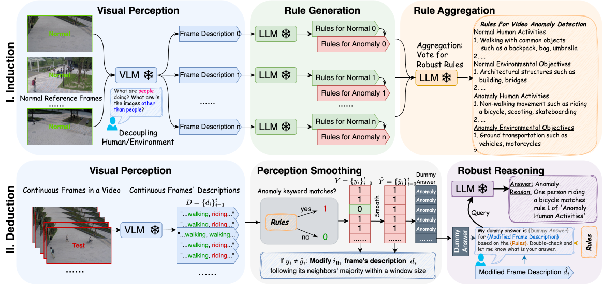

# Follow the Rules: Reasoning for Video Anomaly Detection with Large Language Model (ECCV'24)

This is the official implementation for paper: Follow the Rules: Reasoning for Video Anomaly Detection with Large Language Model.

## Description



The AnomalyRuler pipeline consists of two main stages: induction and deduction. The induction stage involves: i) visual perception transfers normal reference frames to text descriptions; ii) rule generation derives rules based on these descriptions to determine normality and anomaly; iii) rule aggregation employs a voting mechanism to mitigate errors in rules. The deduction stage involves: i) visual perception transfers continuous frames to descriptions; ii) perception smoothing adjusts these descriptions considering temporal consistency to ensure neighboring frames share similar characteristics; iii) robust reasoning rechecks the previous dummy answers and outputs reasoning.

## Dependencies

```
pip install torch==2.1.0 torchvision==0.16.0 transformers==4.35.0 accelerate==0.24.1 sentencepiece==0.1.99 einops==0.7.0 xformers==0.0.22.post7 triton==2.1.0
```

```angular2html
pip installpandas pillow openai scikit-learn protobuf
```

## Run
Run the script within run.sh in order


## Citation

```angular2html
@inproceedings{yang2024anomalyruler,
    title={Follow the Rules: Reasoning for Video Anomaly Detection with Large Language Model},
    author={Yuchen Yang and Kwonjoon Lee and Behzad Dariush and Yinzhi Cao and Shao-Yuan Lo},
    year={2024},
    booktitle={Proceedings of the European Conference on Computer Vision (ECCV)}
}
```
